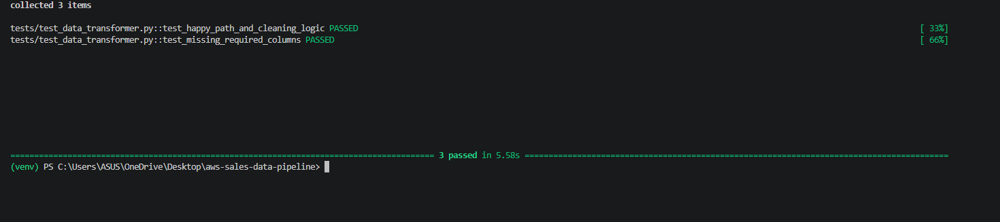
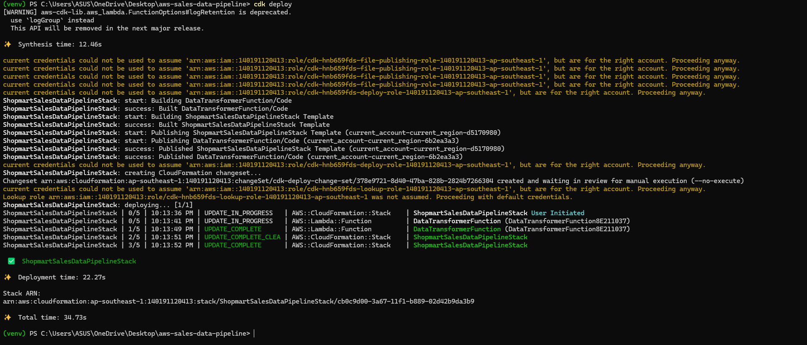
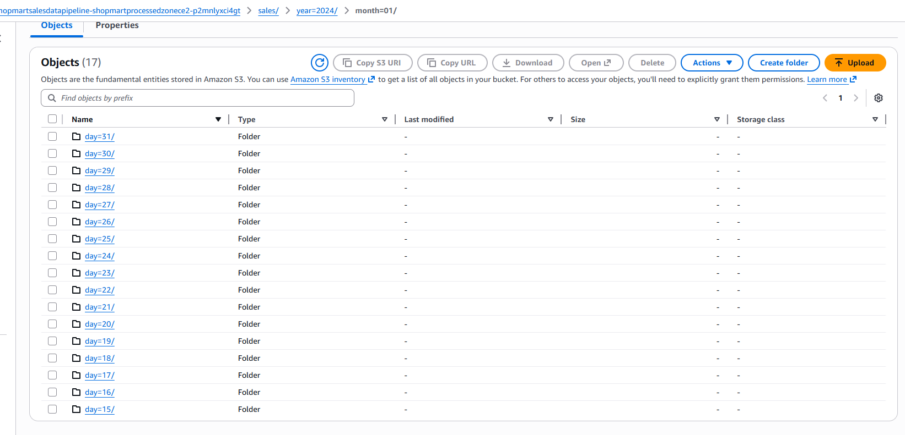
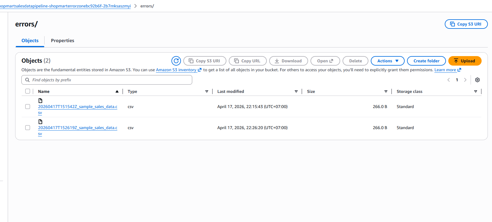
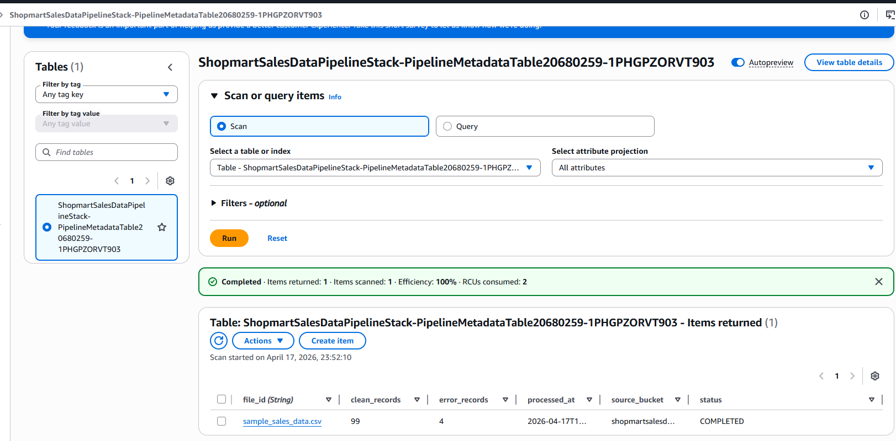
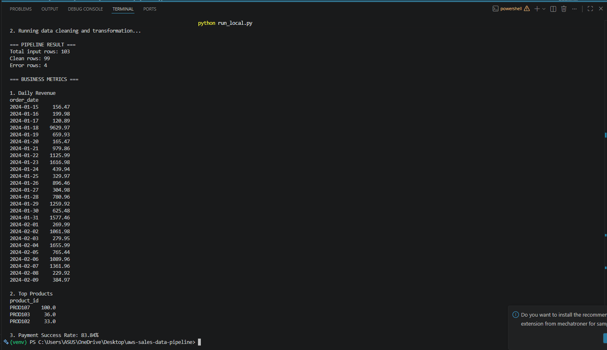
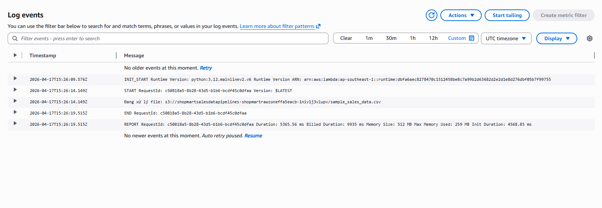

# Shopmart Sales Data Pipeline (AWS)

## Overview

This project implements an event-driven data pipeline on AWS to process retail sales data.

When a CSV file is uploaded to Amazon S3, the system automatically validates, cleans, and transforms the data, then stores results in structured storage for downstream analytics.

---

## Architecture

### Services Used

* Amazon S3 (Raw, Processed, Error storage)
* AWS Lambda (Data processing)
* Amazon DynamoDB (Metadata tracking)
* Amazon CloudWatch (Logging)
* AWS CDK (Infrastructure as Code)

### Data Flow

1. CSV file uploaded to S3 Raw bucket
2. S3 event triggers Lambda function
3. Lambda processes the file:

   * Validates schema
   * Cleans data
   * Splits clean and invalid records
4. Outputs:

   * Clean data → Processed bucket (partitioned)
   * Invalid data → Error bucket
   * Processing metadata → DynamoDB

---

## Key Features

* Event-driven architecture (S3 → Lambda)
* Data validation and cleansing
* Separation of valid and invalid records
* Partitioned storage for optimized querying
* Metadata tracking for observability
* Fully deployed using Infrastructure as Code (AWS CDK)

---

## Project Structure

```text
aws-sales-data-pipeline/
├── infrastructure/      # CDK stack
├── src/                 # Lambda + data processing logic
├── tests/               # Unit tests
├── app.py               # CDK entry point
├── run_local.py         # Local testing script
├── requirements.txt
```

---

## Deployment

### Prerequisites

* AWS CLI configured
* AWS CDK installed

### Deploy infrastructure

```bash
cdk bootstrap
cdk deploy
```

---

## Testing

### Run unit tests

```bash
pytest tests/ -v
```

### Local execution

```bash
python run_local.py
```

---

## Example Output

### DynamoDB Metadata

| file_id               | clean_records | error_records | status    |
| --------------------- | ------------- | ------------- | --------- |
| sample_sales_data.csv | 99            | 4             | COMPLETED |

---

## Design Decisions

### Why S3?

* Scalable storage for raw and processed data
* Native integration with event-driven workflows

### Why Lambda?

* Serverless processing with automatic scaling
* Cost-efficient for event-based workloads

### Why DynamoDB?

* Fast and simple key-value store for metadata
* No schema constraints

---

## Security & IAM

* Principle of least privilege applied to Lambda role
* S3 buckets block public access
* IAM policies scoped to required resources only

---

## Limitations

* Not optimized for very large datasets
* No retry or orchestration layer (e.g., Step Functions)
* No schema evolution handling

---

## Future Improvements

* Add AWS Glue for large-scale processing
* Add Athena for querying processed data
* Add monitoring & alerting (CloudWatch Alarms)
* Introduce workflow orchestration

---

## Cleanup

```bash
cdk destroy
```
## Execution Evidence

### 1. Unit Test Result

All unit tests passed successfully using pytest.

### 2. Deployment

Infrastructure deployed successfully using AWS CDK.

### 3. S3 Raw Upload

CSV file uploaded to raw bucket successfully triggered the pipeline.

### 4. Processed Data

Cleaned data was written to the processed S3 bucket in partitioned format.

### 5. Error Handling

Invalid records were written to the error S3 bucket.

### 6. DynamoDB Metadata

Pipeline execution metadata was recorded successfully.

Example:

* file_id: sample_sales_data.csv
* clean_records: 99
* error_records: 4
* status: COMPLETED

### 7.Business Metrics

The pipeline also computes key business metrics:

- Daily revenue
- Top products
- Payment success rate

### 8. CloudWatch Logs

Lambda execution logs confirm successful processing without runtime errors.

## 📸 Evidence

### Unit Tests


### Infrastructure Deployment


### Processed Data (S3)


### Error Handling (S3)


### Metadata Tracking (DynamoDB)


### Business Metrics


### CloudWatch Logs


## Additional Documentation

- [Architecture Design](./docs/architecture.md)
- [Architecture Decision Records](./docs/adrs.md)
- [Failure Scenarios](./docs/failure-scenarios.md)

## Limitations & Future Improvements

- Add retry mechanism for failed Lambda execution
- Add CloudWatch alerts for failures
- Improve idempotency to avoid duplicate processing
- Integrate with Athena or BI tools for analytics
